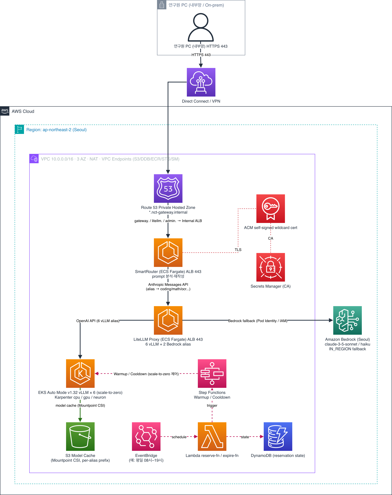

# NCT GenAI Gateway

> 🇰🇷 **한국어**: see [README.md](README.md) (the Korean document is the source of truth).

A region-locked LLM Gateway sample that forces **all inference to happen only in the Seoul (`ap-northeast-2`) region**. Researchers keep using the **Claude Code CLI** as-is, while requests are routed internally to either Amazon Bedrock (Claude Sonnet/Haiku) or one of six open-source vLLM models running on Amazon EKS.

> **What is NCT?** NCT (National Core Technology, 국가핵심기술) is a category defined by South Korea's *Act on Prevention of Divulgence and Protection of Industrial Technology*. When such technology is handled on the cloud, the data — and the access rights to it — must not leave the country ([source law, KR](https://www.law.go.kr/법령/산업기술의유출방지및보호에관한법률)). This sample demonstrates an architecture that satisfies those requirements by operating entirely within a single AWS region (Seoul).

> **Disclaimer — not for production use.** This repository is sample code provided for educational and demonstration purposes only. It is **not intended for production use** and is provided "as is" without warranty of any kind. Review, harden, and test it against your own security, compliance, and operational requirements before deploying. Compliance references to NCT (국가핵심기술) describe *supporting controls* the architecture illustrates; they are not a certification or legal assurance of regulatory compliance.

---

## Why this repo exists

**The problem.** Korean manufacturing, defense, and semiconductor customers handling National Core Technology (NCT, 국가핵심기술) cannot let their data — or the access rights to it — leave the country. That means their LLMs must run **only inside the Seoul (ap-northeast-2) region**. But the only frontier-class *managed* model available in-region in Seoul is effectively **Amazon Bedrock's Claude 3.5 Sonnet** (using cross-region inference would route traffic out of the region and break the NCT requirement).

**What that costs you.** The Claude 3.5 Sonnet (`2024-06-20`) you get in-region on Bedrock scores **≈ 33% on SWE-bench Verified** for agentic coding — only **≈ 37%** of today's frontier ceiling (Claude Opus 4.8 ≈ 88.6%). In other words, the moment you lock yourself into Seoul to stay compliant, you give up more than 60% of frontier coding capability. (Even the updated `2024-10-22` revision is ≈ 49% = ≈ 55% of frontier — still a wide gap.)

**This repo's answer — a hedge that recovers ~82% of frontier.** Open-weight models self-hosted on EKS in Seoul keep all traffic in-region while delivering far higher performance. The `coding` model this CDK ships by default, **Qwen3.5-27B**, scores **≈ 72.4% on SWE-bench Verified = ≈ 82% of frontier** (knowledge/math axes land above 90%). That is **more than double** the in-region Bedrock baseline (≈ 37%).

| In-region (Seoul) option | SWE-bench Verified | vs. frontier (Opus 4.8 = 88.6) |
|----|----|----|
| Bedrock Claude 3.5 Sonnet (`2024-06-20`) — the only managed option | ≈ 33% | **≈ 37%** |
| Bedrock Claude 3.5 Sonnet (`2024-10-22`) | ≈ 49% | ≈ 55% |
| **This CDK's `coding` = Qwen3.5-27B (self-hosted)** | **≈ 72.4%** | **≈ 82%** |

**The message.** The common assumption — *"NCT traps us in Seoul, so we're stuck with a model at 37% of frontier"* — is flipped by this **1-click CDK solution** into *"keep \~80% of frontier in-region in Seoul while staying NCT-compliant on AWS."* Researchers keep using the **Claude Code CLI unchanged**; the gateway routes internally to Bedrock (Seoul) or to self-hosted open-source vLLM. It is not frontier-100%, but \~80% covers most real work — and, critically, it **never breaks data sovereignty.**

> See [How much performance do you give up?](#how-much-performance-do-you-give-up--position-vs-frontier-verified-2026-06) below for the underlying numbers, caveats, and higher-fidelity options (e.g. Qwen3.5-397B). Benchmarks vary by harness/config — **run a PoC on your real workload before adopting.**

---

- **Region pinned**: `ap-northeast-2` (Seoul) — hardcoded in source (supports NCT requirements)
- **Stacks**: 16 CDK stacks
- **Models served**: 6 vLLM (scale-to-zero) + 2 Bedrock (ON_DEMAND, IN_REGION)
- **Endpoints**: HTTPS 443, Route 53 Private Hosted Zone (`*.nct-gateway.internal`)

---

## Architecture



A researcher PC on the internal network reaches the gateway over Direct Connect / Site-to-Site VPN (HTTPS 443) →
Route 53 Private Hosted Zone (`*.nct-gateway.internal`) → SmartRouter (ECS Fargate; analyzes and rewrites the prompt, Anthropic Messages API compatible) →
LiteLLM Proxy (ECS Fargate; 6 vLLM + 2 Bedrock aliases) →
either **EKS Auto Mode** (vLLM × 6, scale-to-zero, Karpenter cpu/gpu/neuron, model cache on S3 Mountpoint CSI)
or **Amazon Bedrock** (Seoul in-region fallback). A Reservation subsystem (EventBridge + Lambda + DynamoDB + Step Functions)
drives vLLM warmup/cooldown on a weekday 08:30–19:30 KST schedule. The entire path stays within a single region (Seoul).

> Editable source: [`docs/architecture/nct-architecture.drawio`](docs/architecture/nct-architecture.drawio) (draw.io)

---

## CDK Stacks (16)

| Stack | Role |
|-------|------|
| `NctNetworkStack` | VPC 10.0.0.0/16, 3 AZ, NAT GW, VPC Endpoints (S3/DDB/ECR/STS/SM) |
| `NctEksStack` | EKS Auto Mode v1.32, S3 Mountpoint CSI driver, model-cache S3 bucket |
| `NctKarpenterStack` | NodePools: cpu / gpu (amd64) / neuron |
| `NctVllm-Coding` | Qwen3.5-27B (g5.12xlarge, 4×A10G) |
| `NctVllm-Video` | Qwen3.5-27B (g5.12xlarge, 4×A10G, vision/video) |
| `NctVllm-Ocr` | InternVL3-14B (g5.12xlarge, 4×A10G) |
| `NctVllm-Math` | Gemma 4 31B (g6e.12xlarge, 4×L40S) |
| `NctVllm-Audio` | Phi-4 Multimodal (g5.xlarge, 1×A10G) |
| `NctVllm-Longcontext` | LLaMA 4 Scout 17B-16E (g6e.48xlarge, 8×L40S) |
| `NctCertStack` | Self-signed wildcard cert `*.nct-gateway.internal` → ACM + Secrets Manager (CA) |
| `NctLiteLLMStack` | LiteLLM ECS Fargate, Internal ALB 443 |
| `NctSmartRouterStack` | SmartRouter ECS Fargate, Internal ALB 443 |
| `NctWarmupStack` | Step Functions (Warmup / Cooldown) |
| `NctReservationStack` | DynamoDB reservation + reserve/expire Lambda + EventBridge |
| `NctAdminConsoleStack` | FastAPI ECS + ALB (`admin.nct-gateway.internal`) |
| `NctDnsStack` | Route53 PHZ `nct-gateway.internal` + alias records |

---

## Model Matrix

### vLLM (EKS Auto Mode, scale-to-zero)

| Alias | Model | EC2 | GPU | Max Ctx | Loading (warm cache) |
|-------|-------|-----|-----|---------|----------------------|
| `coding` | Qwen3.5-27B | g5.12xlarge | 4×A10G | 32,768 | ~8 min (SWE-bench 72.4%) |
| `video` | Qwen3.5-27B | g5.12xlarge | 4×A10G | 32,768 | ~8 min |
| `ocr` | InternVL3-14B | g5.12xlarge | 4×A10G | 8,192 | ~5 min |
| `math` | Gemma 4 31B | g6e.12xlarge | 4×L40S | 32,768 | ~6–8 min |
| `audio` | Phi-4 Multimodal | g5.xlarge | 1×A10G | 16,384 | ~5–7 min |
| `longcontext` | LLaMA 4 Scout 17B-16E | g6e.48xlarge | 8×L40S | 131,072 | **~35 min** |

> Benchmark figures vary by model version — verify against the current model card before relying on them.

- **scale-to-zero**: `minReplicas=0` — GPU nodes are released when idle; the next request triggers Karpenter to provision a node and start vLLM.
- **All warmup (parallel)**: ~35 min, bounded by the slowest model (LLaMA 4 Scout).
- **Cache location**: S3 Mountpoint (`s3://<model-cache-bucket>/<servingName>/`).
- **LLaMA 4 Scout note**: `--enforce-eager` is required (disables CUDA graph capture to avoid >20 min boot).

### How much performance do you give up? — position vs. frontier (verified 2026-06)

> When data-sovereignty requirements stop you from using frontier proprietary models (Claude Opus, GPT, etc.) and you substitute self-hosted open-weight models, you should know **how much capability you're trading away** before adopting.

Comparing the current `coding` alias (**Qwen3.5-27B**) against the frontier ceiling (normalized so that `max(GPT-5.5, Claude Opus 4.8) = 100`):

| Axis | Qwen3.5-27B | Frontier ceiling | **vs. frontier** |
|------|-------------|------------------|------------------|
| Coding (SWE-bench Verified) | 72.4 | 88.6 (Opus 4.8) | **≈ 82%** |
| Knowledge (GPQA Diamond) | 85.5 | 93.6 | ≈ 91% |
| Math (AIME 2026) | 90.8 | ~96.7 | ≈ 94% |
| Code gen (LiveCodeBench v6) | 80.7 | ~88 | ≈ 92% |

- **Headline: on the hardest axis — agentic coding (SWE-bench) — it lands at ≈ 82% of frontier.** The gap narrows on knowledge and math (90%+). What remains is concentrated in "the hardest agentic coding."
- **vs. the in-region managed baseline**: if NCT locks you into Seoul, Bedrock Claude 3.5 Sonnet (`2024-06-20`) is effectively the only frontier-class managed option, and it scores **≈ 33%** on SWE-bench Verified (agentic scaffold, [Anthropic](https://www.anthropic.com/news/swe-bench-sonnet)) = **≈ 37%** of frontier. The updated `2024-10-22` is ≈ 49% (≈ 55%). **Self-hosted Qwen3.5-27B (72.4%, ≈ 82%) more than doubles in-region coding capability over the managed baseline** — this is the core value of this repo (see [Why this repo exists](#why-this-repo-exists) above).
- **If you need higher fidelity**, swap the `coding` alias for the same Qwen3.5 family flagship **Qwen3.5-397B-A17B** (403B MoE / 17B active, all Apache-2.0, self-hostable) — SWE-bench **76.4** (≈ 86% of frontier), 94–99% on knowledge/math. It requires multiple H200 (P5en) GPUs, so cost rises substantially.
- ⚠️ **Reading the numbers**: SWE-bench varies ±3–5 points across harnesses/vendors, and the Qwen figures above are model-card peak reasoning mode — real-world default settings may score lower. **Run a PoC on your actual workload before adopting.**
- Sources: official Qwen HF model cards (`Qwen/Qwen3.5-27B`, `Qwen/Qwen3.5-397B-A17B`) cross-checked with vals.ai (SWE-bench), llm-stats (GPQA), Artificial Analysis.

### Bedrock (ON_DEMAND / IN_REGION Seoul)

| Alias | Bedrock Model ID | Use |
|-------|------------------|-----|
| `claude-3-5-sonnet-20241022` | `anthropic.claude-3-5-sonnet-20240620-v1:0` | Default target for Claude Code CLI |
| `claude-3-haiku-20240307` | `anthropic.claude-3-haiku-20240307-v1:0` | Fast / low-cost (⚠️ check model EOL in the Bedrock console and update the alias to a successor) |

> **If you need an "OpenAI-family" model**: proprietary GPT (e.g. gpt-5.x) has closed weights and cannot be self-hosted. Open-weight **gpt-oss-20b / gpt-oss-120b**, however, can be added as vLLM aliases and run in-region in Seoul. For a Bedrock path, confirm Seoul in-region availability in the console first.

---

## Endpoints

| Purpose | URL | Backend |
|---------|-----|---------|
| Unified entry (recommended, Anthropic-compatible) | `https://gateway.nct-gateway.internal` | SmartRouter → LiteLLM |
| LiteLLM direct (OpenAI API) | `https://litellm.nct-gateway.internal/v1/chat/completions` | LiteLLM |
| Admin Console (operators only) | `https://admin.nct-gateway.internal` | FastAPI |

All use **Internal ALB + ACM (self-signed CA) + HTTPS 443**. Requires Direct Connect / Site-to-Site VPN.

---

## Researcher Onboarding

### One-time setup

1. **Install the CA certificate** — fetch the CA cert from Secrets Manager and add it to your system trust store:
   ```bash
   aws secretsmanager get-secret-value \
     --secret-id /nct/gateway/ca-cert \
     --query SecretString --output text \
     --region ap-northeast-2 > nct-gateway-ca.crt
   # macOS
   sudo security add-trusted-cert -d -r trustRoot \
     -k /Library/Keychains/System.keychain nct-gateway-ca.crt
   ```

2. **Request an API key** — from the gateway operator. Currently a single shared master key.

3. **Configure the Claude Code CLI**
   ```bash
   export ANTHROPIC_BASE_URL=https://gateway.nct-gateway.internal
   export ANTHROPIC_API_KEY=<your-token>
   claude -p "Hello"   # → routed to Bedrock Sonnet (Seoul)
   ```

### Using aliases

```bash
# general: SmartRouter analyzes the prompt and picks the best model
curl https://gateway.nct-gateway.internal/v1/messages \
  -H "x-api-key: $ANTHROPIC_API_KEY" \
  -H "anthropic-version: 2023-06-01" \
  -d '{"model":"general","max_tokens":256,"messages":[...]}'

# force a specific alias
curl https://litellm.nct-gateway.internal/v1/chat/completions \
  -H "Authorization: Bearer $ANTHROPIC_API_KEY" \
  -d '{"model":"coding","messages":[...]}'
```

---

## Warm-up / Reservation

vLLM models sit at `scale-to-zero` when idle, so the first request incurs a 5–35 min cold start. To warm up ahead of time:

```bash
# warm up a specific alias for 1 hour
scripts/warmup-request.sh --alias coding --requester andrew

# multiple aliases + duration
scripts/warmup-request.sh --alias coding,math --duration 2h --requester andrew

# all models for 30 min
scripts/warmup-request.sh --alias all --duration 30m
```

- Reservations are stored in DynamoDB `NctWarmupReservations` → `reserve-fn` triggers the Warmup state machine.
- On expiry, `expire-fn` triggers the Cooldown state machine (extended if overlapping reservations exist).
- **Auto schedule**: weekdays 08:30–19:30 KST, an EventBridge rule warms up all aliases.
- **Admin Console**: `https://admin.nct-gateway.internal` — view current reservations/state and operate manually.

---

## Admin Console

- URL: `https://admin.nct-gateway.internal` (internal network)
- Auth: Basic Auth — password in Secrets Manager `/nct/admin-console/password`
- Features:
  - Current replicas / node status per alias
  - Active reservations and remaining time
  - Manual warm-up / cool-down
  - LiteLLM logs / Bedrock call stats (basic)

---

## NCT Requirements — Supporting Controls

> ⚠️ The technical controls below **support** NCT requirements; deploying this code does not by itself make you "compliant." Actual NCT compliance is a holistic judgment that includes your organization's policies, personnel access controls, auditing, and legal review. Run your own security and legal review.

| Requirement | Supporting technical control |
|-------------|------------------------------|
| All inference in Seoul | `bin/nct-genai-gateway.ts` — region hardcoded |
| Bedrock IN_REGION only | all `BEDROCK_MODELS` in `config/models.ts` are `ap-northeast-2` |
| Bedrock ON_DEMAND only | no Provisioned Throughput / Cross-region Inference |
| Researcher network isolation | Internal ALB + Route53 PHZ, no public endpoint |
| Data in transit encryption | ACM + HTTPS 443 (self-signed wildcard cert) |
| Model weight isolation | S3 bucket in Seoul, per-alias prefix, node IAM scoped |
| AWS API egress | VPC Endpoints (S3/DDB/ECR/STS/SM) — bypasses NAT |

> **Why not Cross-Region Inference (CRIS)?** Even when you call a frontier Bedrock model from Seoul, if that model is offered only via CRIS (a geographic inference profile) rather than in-region, your input prompts and outputs are routed to other regions within the same geography (e.g. APAC) during inference — storage stays in the source region, but **processing leaves Seoul** ([AWS docs](https://docs.aws.amazon.com/bedrock/latest/userguide/geographic-cross-region-inference.html): *"your input prompts and output results might move outside of your source Region during cross-Region inference"*). That is unsuitable where in-country data residency is a requirement. This gateway therefore (1) uses only Seoul **IN_REGION on-demand** Bedrock models, and (2) routes everything else to **self-hosted vLLM** on EKS, so inference never leaves Seoul.

---

## Deployment

### Prerequisites
- AWS CLI configured (`ap-northeast-2` credentials)
- Node.js >= 18, `npm install -g aws-cdk`
- CDK Bootstrap in `ap-northeast-2`

### Deploy

```bash
npm install
AWS_DEFAULT_REGION=ap-northeast-2 cdk deploy --all
# Full deploy ~60-90 min (EKS Auto Mode + 16 stacks)
```

After deploy, record each alias's vLLM NLB DNS in the `vllmEndpoints` context of `cdk.json`, then run `cdk deploy NctLiteLLMStack` once more.

> **Operators**: `operatorRoleArns` and `vllmEndpoints` in `cdk.json` ship empty. Pass your own break-glass role ARN(s) via `-c operatorRoleArns='["arn:aws:iam::<account>:role/<role>"]'` (or set them in your own `cdk.json`); the app handles empty values.

### Phased deploy (recommended)

```bash
# Phase 0: network + EKS + Karpenter
cdk deploy NctNetworkStack NctEksStack NctKarpenterStack

# Phase 1-6: per-model vLLM (optional)
cdk deploy NctVllm-Coding
# (add the rest after researcher feedback)

# Phase 7-10: cert + LiteLLM + SmartRouter + Warmup + Reservation + Admin + DNS
cdk deploy NctCertStack NctLiteLLMStack NctSmartRouterStack \
           NctWarmupStack NctReservationStack NctAdminConsoleStack NctDnsStack
```

---

## Key Design Decisions

### EKS Auto Mode v1.32
- Uses `aws-cdk-lib/aws-eks-v2` (Auto Mode support)
- Only `system` and `general-purpose` NodePools are active; GPU nodes are provisioned by Karpenter
- EBS CSI provisioner: `ebs.csi.eks.amazonaws.com` (Auto Mode specific)

### Model cache: S3 Mountpoint (instead of EFS)
- With EKS Auto Mode + EFS CSI v3.x + Bottlerocket, `amazon-efs-mount-watchdog` fails to detect the init system, so TLS-based NFS mount fails (I1)
- Worked around with the S3 Mountpoint CSI driver (`aws-mountpoint-s3-csi-driver`) — isolated by per-alias prefix, node IAM scoped
- Weight cache persists across reboots / node replacement

### Scale-to-zero + Warm-up
- `minReplicas=0` by default → no standing GPU cost
- Karpenter provisions nodes on demand; vLLM init takes 5–35 min
- Warm-up is orchestrated with Step Functions (up to 50 min timeout)

### Smart Routing
- A `general` alias request is analyzed via prompt embedding → scenario detection → rewritten to `coding`/`math`/... model
- Calling LiteLLM directly lets you target a scenario alias explicitly

### LiteLLM `drop_params: true`
- Claude Code sends Anthropic-only params (`thinking`, `betas`, `anthropic_version`)
- vLLM doesn't understand them, so LiteLLM silently strips them before forwarding to the OpenAI endpoint

### Pod Identity > IRSA
- Bedrock calls and S3 Mountpoint both use EKS Pod Identity
- The S3 Mountpoint CSI driver also wires up an OIDC-based IRSA path

---

## Cost Model

### scale-to-zero (always on)
| Component | Instance | Per hour |
|-----------|----------|----------|
| EKS Control Plane | — | $0.10 |
| Karpenter system nodes | m5.large | ~$0.10 |
| LiteLLM / SmartRouter / Admin ECS | Fargate (0.5 vCPU × 3) | ~$0.10 |
| ALB × 3 (Internal) | — | ~$0.07 |
| NAT GW | — | ~$0.05 |
| S3 Storage (model cache) | ~500 GB | ~$0.02 |
| **Always-on total** | | **\~$0.45/hr (\~$324/month)** |

### When vLLM models are running (per alias)
| Alias | Instance | Per hour (added) |
|-------|----------|------------------|
| coding / video / ocr | g5.12xlarge | ~$5.67 |
| math | g6e.12xlarge | ~$3.90 |
| audio | g5.xlarge | ~$1.00 |
| longcontext | g6e.48xlarge | ~$30.90 |

Monthly cost with the auto schedule (weekdays 08:30–19:30 KST, 11h × 21 days) for full warm-up:
- coding + video + ocr + math + audio: \~$17/hr × 231h = \~$3,927
- + longcontext (only when needed): +$30.90/hr × hours used

> Cost tip: bring up `longcontext` only via reservation (`--alias longcontext`). Keep unneeded aliases at `minReplicas=0`.

> All prices are rough estimates as of authoring. Confirm current rates with the [AWS Pricing Calculator](https://calculator.aws/).

---

## Operations

### Manual scale
```bash
# bring an alias up immediately (bypass Warmup SFN)
kubectl scale deployment <servingName> -n vllm --replicas=1

# bring an alias down immediately
kubectl scale deployment <servingName> -n vllm --replicas=0
```

### Logs
- vLLM: `kubectl logs deploy/<servingName> -n vllm -f`
- LiteLLM: CloudWatch Logs `/ecs/nct-litellm`
- SmartRouter: CloudWatch Logs `/ecs/nct-smart-router`
- Admin Console: CloudWatch Logs `/ecs/nct-admin-console`
- Warmup SFN: Step Functions console `NctWarmup`/`NctCooldown`

### Health checks
```bash
# LiteLLM (callable without auth)
curl https://litellm.nct-gateway.internal/health/liveliness   # → "I'm alive!"

# SmartRouter
curl https://gateway.nct-gateway.internal/health
```

---

## Known Issues

| # | Issue | Status |
|---|-------|--------|
| I1 | Bottlerocket + EFS TLS mount failure | Worked around with S3 Mountpoint (stable in operation) |
| I8 | No per-researcher API keys | Single shared master key. To be split with LiteLLM virtual keys |
| — | Bedrock model EOL | Update the alias to a Seoul IN_REGION successor; check EOL dates in the Bedrock console |

---

## Cleanup

```bash
cdk destroy --all --force
```

- EKS Auto Mode deletion ~15 min
- The S3 model-cache bucket uses a RETAIN policy (weights preserved)

---

## Related

- [vLLM docs](https://docs.vllm.ai)
- [LiteLLM docs](https://docs.litellm.ai)
- [Amazon EKS Auto Mode](https://docs.aws.amazon.com/eks/latest/userguide/automode.html)
- [Claude Code — LLM Gateway setup](https://code.claude.com/docs/en/llm-gateway)
- [NCT source law (KR, Act on Prevention of Divulgence and Protection of Industrial Technology)](https://www.law.go.kr/법령/산업기술의유출방지및보호에관한법률)
