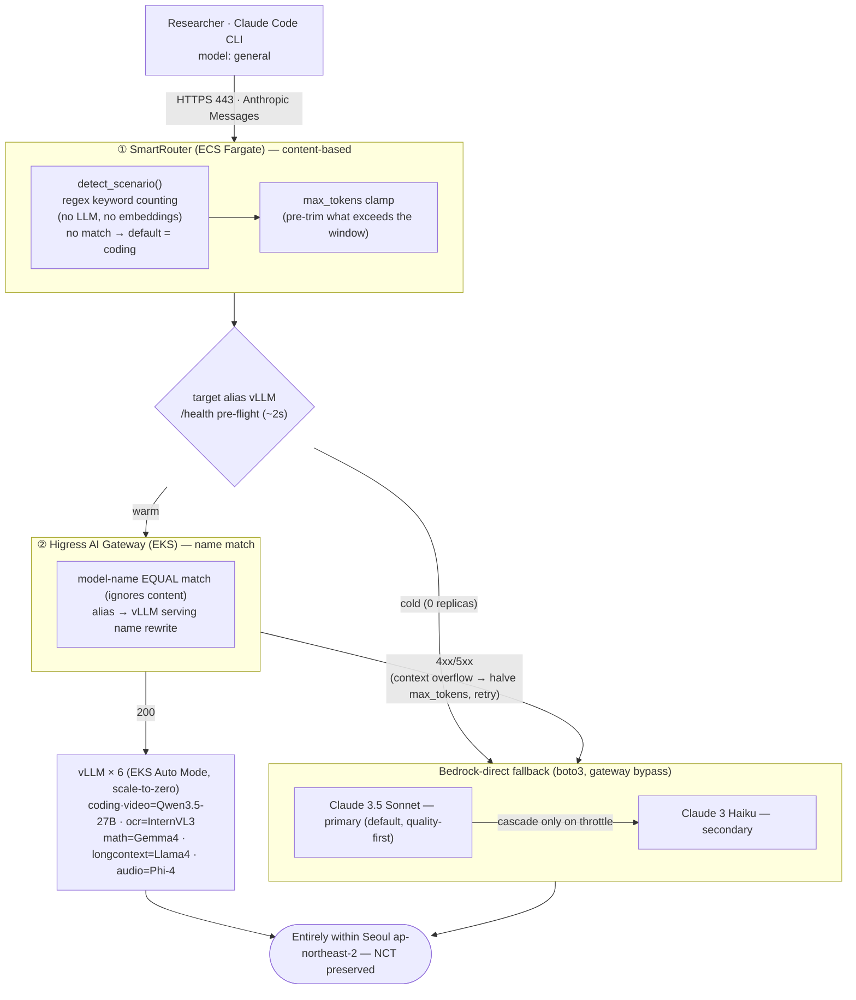

# NCT GenAI Gateway

> 🇰🇷 **한국어**: see [README.md](README.md) (the Korean document is the source of truth).

A company handling **National Core Technology (NCT)** in Korea is legally required to process **all AI inference inside Korea**. The catch: staying compliant leaves you, in practice, with a single high-end option that reaches only **~37% of a frontier model's capability**. This sample lifts that ceiling to **~82%** while keeping your data **100% inside Korea**.

**Without this solution** — you are forced to pick one of three bad options:

- Use **only in-region (Seoul) managed models** to stay compliant → you give up **more than 60% of coding capability**.
- Use **models in overseas regions** for performance → you take on the **risk of violating NCT**.
- Run **your own GPUs 24/7** to get both → **cost balloons** beyond what is sustainable.

**With this solution** — researchers keep using the **Claude Code CLI exactly as before** (no retraining). The gateway **automatically routes each request to the best backend inside the Seoul region**. The AI capability you can actually use rises from **~37% to ~82% of frontier**, and your data **never leaves Korea**.

**What you also get**

- **Near-zero cost when idle** — GPUs scale to zero when no one is sending requests (scale-to-zero).
- **Warm when you need it** — a reservation feature pre-warms models to match working hours.
- **Seamless fallback** — if a self-hosted model is not up yet, requests fall back to Bedrock (Seoul) so responses never stall.

---

A region-locked LLM Gateway sample that forces **all inference to happen only in the Seoul (`ap-northeast-2`) region**. Researchers keep using the **Claude Code CLI** as-is, while requests are routed internally to either Amazon Bedrock (Claude Sonnet/Haiku) or one of six open-source vLLM models running on Amazon EKS.

> **What is NCT?** NCT (National Core Technology, 국가핵심기술) is a category defined by South Korea's *Act on Prevention of Divulgence and Protection of Industrial Technology*. When such technology is handled on the cloud, the data — and the access rights to it — must not leave the country ([source law, KR](https://www.law.go.kr/법령/산업기술의유출방지및보호에관한법률)). This sample demonstrates an architecture that satisfies those requirements by operating entirely within a single AWS region (Seoul).

> **Disclaimer — not for production use.** This repository is sample code provided for educational and demonstration purposes only. It is **not intended for production use** and is provided "as is" without warranty of any kind. Review, harden, and test it against your own security, compliance, and operational requirements before deploying. Compliance references to NCT (국가핵심기술) describe *supporting controls* the architecture illustrates; they are not a certification or legal assurance of regulatory compliance.

---

## TL;DR

**Who** — Korean manufacturing, defense, and semiconductor customers who must keep all inference inside the Seoul region for National Core Technology (NCT, 국가핵심기술) reasons.
**What** — Researchers keep using the **Claude Code CLI unchanged**; the gateway routes internally to Seoul in-region Bedrock or to self-hosted open-source vLLM on EKS. Traffic never leaves the region.
**Why** — In-region managed models alone trap you at ~37% of frontier; this repo's self-hosted `coding` (Qwen3.5-27B) reaches **~82% of frontier** in-region.

**How (deploy → try → clean up):**

```bash
npm install

# [1] Infrastructure — deploy all stacks (~60-90 min, EKS Auto Mode + 17 stacks, test client included)
AWS_DEFAULT_REGION=ap-northeast-2 cdk deploy --all

# [2] Post-deploy — discover NLB DNS → rewire SmartRouter → apply Higress config
./scripts/finalize-deploy.sh

# [3] Try it — SSM into the in-VPC test client (located by Name tag, not a hard-coded id)
aws ssm start-session --region ap-northeast-2 --target \
  "$(aws ec2 describe-instances --region ap-northeast-2 \
       --filters Name=tag:Name,Values=nct-test-client Name=instance-state-name,Values=running \
       --query 'Reservations[0].Instances[0].InstanceId' --output text)"
bash -l                              # ★ loads the gateway env

# [4] Test — cold falls back to Bedrock (Seoul); after `nct-warmup coding` the same command hits vLLM (Qwen3.5)
claude "Refactor this function for readability: ..."

# [5] Clean up — tear everything down when done
cdk destroy --all --force
```

> There are **required prerequisites** — a HuggingFace token (required), and, if you use `longcontext`/`math`, gated-model license approval. Read **[Prerequisites](#prerequisites)** before you start. Phased deploy, the hands-on try-it, and operational options are under **[Deployment](#deployment)**.

- **Region pinned**: `ap-northeast-2` (Seoul) — hardcoded in source (supports NCT requirements)
- **Stacks**: 17 CDK stacks (test client included by default; 16 with `-c deployTestClient=false`)
- **Models served**: 6 vLLM (scale-to-zero) + 2 Bedrock (ON_DEMAND, IN_REGION)
- **Endpoints**: HTTPS 443, Route 53 Private Hosted Zone (`*.nct-gateway.internal`)

---

<details>
<summary><strong>Why this repo exists</strong> — NCT locks you into Seoul at ~37% of frontier; this repo lifts that to ~82% via self-hosting (expand for the argument and benchmarks)</summary>

### Why this repo exists

**The problem.** Korean manufacturing, defense, and semiconductor customers handling National Core Technology (NCT, 국가핵심기술) cannot let their data — or the access rights to it — leave the country. That means their LLMs must run **only inside the Seoul (ap-northeast-2) region**. But the only frontier-class *managed* model available in-region in Seoul is effectively **Amazon Bedrock's Claude 3.5 Sonnet** (using cross-region inference would route traffic out of the region and break the NCT requirement).

**What that costs you.** The Claude 3.5 Sonnet (`2024-06-20`) you get in-region on Bedrock scores **≈ 33% on SWE-bench Verified** for agentic coding — only **≈ 37%** of today's frontier ceiling (Claude Opus 4.8 ≈ 88.6%). In other words, the moment you lock yourself into Seoul to stay compliant, you give up more than 60% of frontier coding capability. (Even the updated `2024-10-22` revision is ≈ 49% = ≈ 55% of frontier — still a wide gap.)

**This repo's answer — a hedge that recovers ~82% of frontier.** Open-weight models self-hosted on EKS in Seoul keep all traffic in-region while delivering far higher performance. The `coding` model this CDK ships by default, **Qwen3.5-27B**, scores **≈ 72.4% on SWE-bench Verified = ≈ 82% of frontier** (knowledge/math axes land above 90%). That is **more than double** the in-region Bedrock baseline (≈ 37%).

| In-region (Seoul) option | SWE-bench Verified | vs. frontier (Opus 4.8 = 88.6) |
|----|----|----|
| Bedrock Claude 3.5 Sonnet (`2024-06-20`) — the only managed option | ≈ 33% | **≈ 37%** |
| Bedrock Claude 3.5 Sonnet (`2024-10-22`) | ≈ 49% | ≈ 55% |
| **This CDK's `coding` = Qwen3.5-27B (self-hosted)** | **≈ 72.4%** | **≈ 82%** |

**The message.** The common assumption — *"NCT traps us in Seoul, so we're stuck with a model at 37% of frontier"* — is flipped by this **2-command CDK solution** (`cdk deploy --all` → `finalize-deploy.sh`) into *"keep \~80% of frontier in-region in Seoul while staying NCT-compliant on AWS."* It is not frontier-100%, but \~80% covers most real work — and, critically, it **never breaks data sovereignty.**

> See the *How much performance do you give up?* expandable under **Model Matrix** below for the underlying numbers, caveats, and higher-fidelity options (e.g. Qwen3.5-397B). Benchmarks vary by harness/config — **run a PoC on your real workload before adopting.**

</details>

---

## Architecture


A researcher PC on the internal network reaches the gateway over Direct Connect / Site-to-Site VPN (HTTPS 443) →
Route 53 Private Hosted Zone (`*.nct-gateway.internal`) → SmartRouter (ECS Fargate; analyzes and rewrites the prompt, Anthropic Messages API compatible) →
Higress AI Gateway (EKS; Anthropic↔OpenAI conversion, key-auth, 6 vLLM + 2 Bedrock providers) →
either **EKS Auto Mode** (vLLM × 6, scale-to-zero, Karpenter cpu/gpu/neuron, model cache on S3 Mountpoint CSI)
or **Amazon Bedrock** (Seoul in-region fallback). When a vLLM alias is cold, SmartRouter detects it via a pre-flight and falls back directly to Bedrock (bypassing the gateway).
A Reservation subsystem (EventBridge + Lambda + DynamoDB + Step Functions)
drives vLLM warmup/cooldown on a weekday 08:30–19:30 KST schedule. The entire path stays within a single region (Seoul).

> Editable source: [`docs/architecture/nct-architecture.drawio`](docs/architecture/nct-architecture.drawio) (draw.io)

### Routing flow (2 stages)

A request reaches a backend in **two stages**. Contrary to a common assumption, *Higress does not route by content* — the upstream **SmartRouter** picks an alias from the content, and **Higress matches only on that alias name**.



**① SmartRouter — content-based alias selection (no LLM).** For a `model:general` request, `detect_scenario()` analyzes the prompt and picks one of the 6 aliases. It is **pure regex keyword counting** — not an inference LLM or embedding similarity:
- Multimodal is decided up front — an `audio/*` content block → `audio`, `video/*` → `video`.
- Text over 60,000 chars → `longcontext`.
- Otherwise the **match count** of the `math`/`coding`/`ocr` regexes picks the top-scoring alias.
- **All zero → default = `coding`** (Qwen3.5-27B is the strongest general-purpose model). So generic/miscellaneous questions all route to `coding`.

Specifying an alias directly (e.g. `model:coding`) skips `detect_scenario` and passes through.

**② Higress — alias-name match only (dumb router).** Once SmartRouter rewrites `model` to the chosen alias, Higress does not re-inspect content — it selects a route by **EQUAL (exact) match** on `modelPredicates`, then the provider's `modelMapping` rewrites the alias to the actual vLLM serving name (e.g. `coding`→`qwen35-27b`) before the upstream call.

**Fallback is owned by SmartRouter, not Higress.** vLLM routes carry **no** cross-provider fallback on purpose (Higress ai-proxy 2.0.0 mis-signs Bedrock `/v1/messages` SigV4 — [higress#3809](https://github.com/alibaba/higress/issues/3809)). Instead SmartRouter handles it in two layers: (1) **pre-flight** — if the target alias's vLLM is cold (0 replicas), bypass Higress and go straight to Bedrock-direct; (2) **reactive** — if Higress returns 4xx/5xx (e.g. a context-window 400 → halve `max_tokens` and retry), fall through to Bedrock-direct. In either path the fallback target is the **scenario-agnostic common in-region Bedrock** (default Sonnet→Haiku, flip with `-c coldFallbackOrder`) — there is no math-specific or coding-specific Bedrock. See the [FAQ](#faq) for details.

---

## Deployment

### Prerequisites

- AWS CLI configured (`ap-northeast-2` credentials)
- Node.js >= 18, `npm install -g aws-cdk`
- CDK Bootstrap in `ap-northeast-2`
- **HuggingFace token (required)** — see step 1 below.
- **Gated model license approval (optional)** — only when deploying `longcontext`/`math`. See step 2 below.

#### 1. Create a HuggingFace token + register it in Secrets Manager (required)

vLLM pods use the HF token to pull model weights. **If it is missing, vLLM pods fail to start (while the GPU node they triggered keeps billing) and `NctEksStack` deployment fails fast** — a deploy-time sanity check rejects an absent `hf-token`.

1. Sign up / log in at [huggingface.co](https://huggingface.co/join).
2. **Settings → Access Tokens → New token** → choose Type **Read** → copy the generated `hf_...` token. (Read scope is enough — it is only used to download weights.)
3. Register that token in Secrets Manager (the key *inside* the secret must be named `token`):

   ```bash
   aws secretsmanager create-secret \
     --name hf-token \
     --secret-string '{"token":"hf_xxxxxxxx"}' \
     --region ap-northeast-2
   ```

#### 2. Approve gated-model licenses (optional — only if you use `longcontext`/`math`)

**2 of the 6 default models are gated** — they require accepting a license on HF before they can be downloaded. Deploying without approval makes those vLLM pods fail to start with an **HF 401/403**.

| Alias | Model | Approval step |
|-------|-------|---------------|
| `longcontext` | [`meta-llama/Llama-4-Scout-17B-16E-Instruct`](https://huggingface.co/meta-llama/Llama-4-Scout-17B-16E-Instruct) | Accept the Meta license + get the access request approved on the model card |
| `math` | [`google/gemma-4-31b-it`](https://huggingface.co/google/gemma-4-31b-it) | Accept the Google Gemma license on the model card |

- Click "Agree and access" (the access request) on each model card **using the same HF account you minted the token with**.
- The other four (`coding`/`video` = Qwen3.5-27B [Apache-2.0], `ocr` = InternVL3-14B, `audio` = Phi-4 Multimodal) are **not gated** — no extra approval needed.
- **If you won't use those two models**, simply leave their vLLM stacks (`NctVllm-Longcontext`/`NctVllm-Math`) out of the deploy (omit them in the *Phased deploy* below, or skip them in `cdk deploy`). The remaining stacks deploy fine without any gated approval.
- ⚠️ Whether a model is gated, and its license terms, are model-card policy and can change. **Verify on each model card at deploy time.**

### Deploy (2-command)

The crux of the gateway data plane is the NLBs that k8s provisions **after** deploy (6 vLLM + the Higress gateway). Their DNS is unknown at synth time and can't be hardcoded with a CDK token, so **infrastructure** and **post-deploy wiring** split into two commands:

```bash
npm install

# [1] Infrastructure — deploy all stacks (~60-90 min, EKS Auto Mode + 17 stacks, test client included)
AWS_DEFAULT_REGION=ap-northeast-2 cdk deploy --all

# [2] Post-deploy — discover NLB DNS → rewire SmartRouter → apply Higress config
./scripts/finalize-deploy.sh
```

`finalize-deploy.sh` handles the rest in one shot (zero copy-paste):

1. **Discover NLB DNS** — looks up the 6 vLLM + Higress gateway NLB DNS via `kubectl` and writes them into the `cdk.json` context (`vllmEndpoints`, `higressEndpoint`) — `scripts/get-endpoints.sh --write-context`.
2. **Rewire SmartRouter** — `cdk deploy NctSmartRouterStack -c higressEndpoint=<discovered>` points the upstream at the Higress gateway NLB.
3. **Apply Higress config** — provider/route/key-auth consumer via the console REST API (`scripts/apply-higress.sh`). **On a first deploy with no console admin yet, it auto-bootstraps via `/system/init`** (admin PW fixed to the gateway master-key, recoverable from Secrets Manager afterward).

On completion it prints a banner with the entry point (`https://gateway.nct-gateway.internal`), how to fetch the master-key, and how to reach the test client. Re-running is idempotent (re-discover NLB DNS → SmartRouter no-op → Higress upsert).

### Try it + clean up (3–5)

The deploy **includes an in-VPC test client (one EC2 instance) by default** — it boots with Claude Code pre-installed and wired to the gateway, reachable **only via SSM Session Manager**. You can experience the gateway hands-on right away (details under [Try it](#try-it-in-vpc-test-client-included-by-default)).

```bash
# [3] SSM in — locate by the Name tag (nct-test-client). (CloudFormation output also works:
#     aws cloudformation describe-stacks --stack-name NctTestClientStack --query ...InstanceId)
aws ssm start-session --region ap-northeast-2 --target \
  "$(aws ec2 describe-instances --region ap-northeast-2 \
       --filters Name=tag:Name,Values=nct-test-client Name=instance-state-name,Values=running \
       --query 'Reservations[0].Instances[0].InstanceId' --output text)"
bash -l                  # ★ loads the gateway env (do not use plain bash)

# [4] Cold falls back to Bedrock (Seoul). After nct-warmup coding, the same command hits vLLM (Qwen3.5)
claude "Refactor this function for readability: ..."
nct-warmup coding 2h     # timed reservation (auto-cools-down at expiry); poll with nct-status
claude "Refactor this function for readability: ..."   # now vLLM directly
nct-cooldown coding      # clear reservation + scale to zero when done (stop GPU billing)

# [5] Tear down the demo — delete all stacks
cdk destroy --all --force
```

> If you don't need the test client, exclude it with `cdk deploy --all -c deployTestClient=false` (16 stacks). When included, it's a burstable t3.small in **standard credit mode**, so idle cost is negligible (~$0.024/hr).

> **Operators**: `operatorRoleArns` in `cdk.json` ships empty (`vllmEndpoints`/`higressEndpoint` are filled by `finalize-deploy.sh`). Pass your own break-glass role ARN(s) via `-c operatorRoleArns='["arn:aws:iam::<account>:role/<role>"]'` (or set them in your own `cdk.json`); the app handles empty values.

### Phased deploy (recommended)

```bash
# Phase 0: network + EKS + Karpenter
cdk deploy NctNetworkStack NctEksStack NctKarpenterStack

# Phase 1-6: per-model vLLM (optional)
#   add gated models (NctVllm-Longcontext, NctVllm-Math) only after HF approval
cdk deploy NctVllm-Coding
# (add the rest after researcher feedback)

# Phase 7-10: cert + Higress + SmartRouter + Warmup + Reservation + Admin + DNS
#   (NctHigressStack's Helm release/NLB render into NctEksStack, so redeploy NctEksStack too)
cdk deploy NctCertStack NctEksStack NctHigressStack NctSmartRouterStack \
           NctWarmupStack NctReservationStack NctAdminConsoleStack NctDnsStack

# Post-deploy: discover NLB DNS → rewire SmartRouter → apply Higress config
./scripts/finalize-deploy.sh
```

---

## Endpoints

| Purpose | URL | Backend |
|---------|-----|---------|
| Unified entry (Anthropic-compatible) | `https://gateway.nct-gateway.internal` | SmartRouter → Higress |
| Admin Console (operators only) | `https://admin.nct-gateway.internal` | FastAPI |

All use **Internal ALB + ACM (self-signed CA) + HTTPS 443**. Requires Direct Connect / Site-to-Site VPN.

---

## Researcher Onboarding

### One-time setup

1. **Install the CA certificate** — fetch the CA cert from Secrets Manager and add it to your system trust store:
   ```bash
   aws secretsmanager get-secret-value \
     --secret-id /nct/gateway/ca-cert \
     --query SecretString --output text \
     --region ap-northeast-2 > nct-gateway-ca.crt
   # macOS
   sudo security add-trusted-cert -d -r trustRoot \
     -k /Library/Keychains/System.keychain nct-gateway-ca.crt
   ```

2. **Request an API key** — from the gateway operator. Currently a single shared master key.

3. **Configure the Claude Code CLI**
   ```bash
   export ANTHROPIC_BASE_URL=https://gateway.nct-gateway.internal
   export ANTHROPIC_API_KEY=<your-token>
   claude -p "Hello"   # → routed to Bedrock Sonnet (Seoul)
   ```

### Using aliases

```bash
# general: SmartRouter analyzes the prompt and picks the best model
curl https://gateway.nct-gateway.internal/v1/messages \
  -H "x-api-key: $ANTHROPIC_API_KEY" \
  -H "anthropic-version: 2023-06-01" \
  -d '{"model":"general","max_tokens":256,"messages":[...]}'

# force a specific alias (put the alias in the model field)
curl https://gateway.nct-gateway.internal/v1/messages \
  -H "x-api-key: $ANTHROPIC_API_KEY" \
  -H "anthropic-version: 2023-06-01" \
  -d '{"model":"coding","max_tokens":256,"messages":[...]}'
```

---

## Try it: in-VPC test client (included by default)

So you can experience the gateway hands-on, the deploy **includes** one test EC2 instance inside the VPC. It boots with Claude Code (the GenAI harness) pre-installed and wired to the gateway, reachable **only via SSM Session Manager** (no public IP, no SSH — it tunnels in over the SSM VPC endpoints). The instance is a burstable **t3.small in standard credit mode** — idle cost is negligible (~$0.024/hr), and bursts above baseline are throttled rather than billed.

```bash
# Included by default — `cdk deploy --all` brings up NctTestClientStack with it.
# Exclude it if you don't need it (16 stacks):
cdk deploy --all -c deployTestClient=false
```

The point is to **compare cold vs. warm with the same command**. The client pins one model (`general`); SmartRouter's automatic fallback handles the switch:

```bash
# 1) Connect over SSM — locate by the Name tag instead of a hard-coded id
aws ssm start-session --region ap-northeast-2 --target \
  "$(aws ec2 describe-instances --region ap-northeast-2 \
       --filters "Name=tag:Name,Values=nct-test-client" \
                 "Name=instance-state-name,Values=running" \
       --query 'Reservations[0].Instances[0].InstanceId' --output text)"

# After connecting — ★ bash -l is required (loads the gateway env). Plain bash won't.
bash -l

# Show the walkthrough / check which backend answers right now
nct-demo
nct-which                 # model + x-nct-fallback header (cold=bedrock-direct, warm=qwen, no header)

# 2) BEFORE warm-up (GPU cold): the vLLM alias has 0 replicas, so SmartRouter
#    detects the cold alias and falls back directly to in-region Bedrock (Claude 3.5 Sonnet, Seoul)
claude "Refactor this function for readability: ..."

# 3) Warm up the GPU model (a few minutes; poll with nct-status) — timed: auto-cools-down at expiry
nct-warmup coding 2h      # 2h / 90m / 3600(seconds) · default 1h
nct-status                # coding shows WARM (reserved, ~Nm left) once ready

# 4) AFTER warm-up: the SAME command now routes to self-hosted Qwen3.5-27B (vLLM)
claude "Refactor this function for readability: ..."

# 5) Stop GPU billing when done (manual stop before expiry)
nct-cooldown coding       # clear reservation + scale the alias back to zero replicas
```

| Helper | What it does |
|--------|--------------|
| `nct-which [max_tokens]` | Which backend answers `coding` right now (model + `x-nct-fallback` header) |
| `nct-warmup <alias> [dur]` | **Timed reservation** to spin up the alias (`2h`/`90m`/`3600`, default 1h); auto-cools-down at expiry |
| `nct-status` | Per-alias warm/cold + reservation time left + recent warm-up progress |
| `nct-cooldown <alias>` | Clear the reservation, then scale the alias to zero (`nct <alias>` is a back-compat alias) |
| `nct-demo` | Print the walkthrough above |

> **How the switch works**: the client always sends `ANTHROPIC_MODEL=general`. SmartRouter pre-flights the target alias's vLLM NLB `/health` (~2s) **before** calling Higress. If cold (0 healthy targets) it bypasses the gateway and falls back directly to Bedrock Seoul (boto3, native Anthropic Messages); if warm it goes the normal Higress→vLLM path. A reactive fallback (Bedrock-direct) is also kept as a safety net for gateway/vLLM errors. The same command compares both backends with no client-side code or model-name change.

> **Why `nct-warmup` is reservation-based**: rather than calling the warm-up SFN directly, `nct-warmup` invokes **reserve-fn** (a DynamoDB reservation + a one-shot EventBridge Scheduler expiry). When the chosen duration elapses, the alias **auto-scales-to-zero** — so an idle GPU never lingers because someone forgot to stop it (g5.12xlarge ~$5.7/hr). `nct-cooldown` is the manual stop before expiry; it **clears the reservation rows first**, then scales to zero — reserve-fn only boots on a 0→1 reservation transition, so a leftover row would make the next `nct-warmup` silently no-op.

### Verifying the warm-path `max_tokens` clamp (step by step)

Confirms that while warm (vLLM), a large Claude Code `max_tokens` (32000 by default) does **not** overflow the model's context window into a vLLM 400 → Bedrock fallback, but is served **directly by vLLM**. (On a context-overflow 400, SmartRouter halves `max_tokens` and retries — iterative-halving clamp.)

```bash
# STEP 0 — connect (same as 1) above: Name tag → bash -l)

# STEP 1 — confirm cold: Bedrock should answer right now
nct-which 32000
#   expect (cold): model=claude-3-5-sonnet-... (or haiku)  +  x-nct-fallback: bedrock-direct

# STEP 2 — warm up (GPU boot, ~10 min)
nct-warmup coding 1h
nct-status                      # repeat until coding shows WARM

# STEP 3 — verify warm: judge the backend by the HEADER only (model self-report is meaningless)
nct-which 32000
#   expect (warm): model=qwen35-27b  +  x-nct-fallback: (none) = vLLM-direct
#   if x-nct-fallback: bedrock-direct appears → regression (please report)

# STEP 4 — real claude CLI on a large task (confirm vLLM-direct via the header)
claude --debug -p "Summarize the design tradeoffs of a large codebase in detail." 2>&1 \
  | grep -i 'x-nct-fallback' \
  && echo "↑ bedrock-direct means it fell back (defect)" \
  || echo "no fallback header = vLLM-direct (correct)"

# STEP 5 — stop billing when done (manual, before the reservation expires)
nct-cooldown coding
```

> ⚠️ **Judge the backend by the `x-nct-fallback` header only.** Asking claude "who are you" is useless — its identity is injected via the system prompt, so even when Qwen serves the request it answers `claude-...`. Never trust the model self-report.

---

## Model Matrix

### vLLM (EKS Auto Mode, scale-to-zero)

| Alias | Model | License | EC2 | GPU | Max Ctx | Loading (warm cache) | Headline benchmark |
|-------|-------|---------|-----|-----|---------|----------------------|--------------------|
| `coding` | Qwen3.5-27B | Apache-2.0 | g5.12xlarge | 4×A10G | 32,768 | ~8 min | SWE-bench 72.4% / LCB v6 80.7% |
| `video` | Qwen3.5-27B | Apache-2.0 | g5.12xlarge | 4×A10G | 32,768 | ~8 min | MMMU 85.0 (vision/video) |
| `ocr` | InternVL3-14B | MIT | g5.12xlarge | 4×A10G | 8,192 | ~5 min | DocVQA 94.1 / OCRBench 875 |
| `math` | Gemma 4 31B | **gated** (Gemma) | g6e.12xlarge | 4×L40S | 32,768 | ~6–8 min | AIME 2026 89.2% / GPQA 84.3% |
| `audio` | Phi-4 Multimodal | MIT | g5.xlarge | 1×A10G | 16,384 | ~5–7 min | unified audio+vision |
| `longcontext` | LLaMA 4 Scout 17B-16E | **gated** (Meta) | g6e.48xlarge | 8×L40S | 131,072 | **~35 min** | 128K context / MoE (17B active) |

- **Gated models** (`math`·`longcontext`) require prior HF license approval — see [Prerequisites](#prerequisites) step 2. If you don't use them, just leave their stacks out of the deploy.
- **scale-to-zero**: `minReplicas=0` — GPU nodes are released when idle; the next request triggers Karpenter to provision a node and start vLLM.
- **All warmup (parallel)**: ~35 min, bounded by the slowest model (LLaMA 4 Scout).
- **Cache location**: S3 Mountpoint (`s3://<model-cache-bucket>/<servingName>/`).
- **LLaMA 4 Scout note**: `--enforce-eager` is required (disables CUDA graph capture to avoid >20 min boot).
- ⚠️ Licenses and benchmark figures are per the model card and can change — **verify on each model card at deploy time.**

### Bedrock (ON_DEMAND / IN_REGION Seoul)

| Alias | Bedrock Model ID | Use |
|-------|------------------|-----|
| `claude-3-5-sonnet-20241022` | `anthropic.claude-3-5-sonnet-20240620-v1:0` | Default target for Claude Code CLI |
| `claude-3-haiku-20240307` | `anthropic.claude-3-haiku-20240307-v1:0` | Fast / low-cost (⚠️ check model EOL in the Bedrock console and update the alias to a successor) |

> **Alias ≠ served model ID**: in the first row the client alias (`...20241022`) and the actually-served Bedrock Model ID (`...20240620-v1:0`) intentionally differ. The left is the model string Claude Code CLI sends; the right is the Sonnet 3.5 that actually answers in-region in Seoul. This maps whichever Sonnet alias the CLI sends to the in-region model.

> **If you need an "OpenAI-family" model**: proprietary GPT (e.g. gpt-5.x) has closed weights and cannot be self-hosted. Open-weight **gpt-oss-20b / gpt-oss-120b**, however, can be added as vLLM aliases and run in-region in Seoul. For a Bedrock path, confirm Seoul in-region availability in the console first.

<details>
<summary><strong>How much performance do you give up?</strong> — position vs. frontier, higher-fidelity options, caveats (verified 2026-06, expand)</summary>

### How much performance do you give up? — position vs. frontier (verified 2026-06)

> When data-sovereignty requirements stop you from using frontier proprietary models (Claude Opus, GPT, etc.) and you substitute self-hosted open-weight models, you should know **how much capability you're trading away** before adopting.

Comparing the current `coding` alias (**Qwen3.5-27B**) against the frontier ceiling (normalized so that `max(GPT-5.5, Claude Opus 4.8) = 100`):

| Axis | Qwen3.5-27B | Frontier ceiling | **vs. frontier** |
|------|-------------|------------------|------------------|
| Coding (SWE-bench Verified) | 72.4 | 88.6 (Opus 4.8) | **≈ 82%** |
| Knowledge (GPQA Diamond) | 85.5 | 93.6 | ≈ 91% |
| Math (AIME 2026) | 90.8 | ~96.7 | ≈ 94% |
| Code gen (LiveCodeBench v6) | 80.7 | ~88 | ≈ 92% |

- **Headline: on the hardest axis — agentic coding (SWE-bench) — it lands at ≈ 82% of frontier.** The gap narrows on knowledge and math (90%+). What remains is concentrated in "the hardest agentic coding."
- **vs. the in-region managed baseline**: if NCT locks you into Seoul, Bedrock Claude 3.5 Sonnet (`2024-06-20`) is effectively the only frontier-class managed option, and it scores **≈ 33%** on SWE-bench Verified (agentic scaffold, [Anthropic](https://www.anthropic.com/news/swe-bench-sonnet)) = **≈ 37%** of frontier. The updated `2024-10-22` is ≈ 49% (≈ 55%). **Self-hosted Qwen3.5-27B (72.4%, ≈ 82%) more than doubles in-region coding capability over the managed baseline** — this is the core value of this repo (see *TL;DR* and the *Why this repo exists* expandable above).
- **If you need higher fidelity**, swap the `coding` alias for the same Qwen3.5 family flagship **Qwen3.5-397B-A17B** (403B MoE / 17B active, all Apache-2.0, self-hostable) — SWE-bench **76.4** (≈ 86% of frontier), 94–99% on knowledge/math. It requires multiple H200 (P5en) GPUs, so cost rises substantially.
- ⚠️ **Reading the numbers**: SWE-bench varies ±3–5 points across harnesses/vendors, and the Qwen figures above are model-card peak reasoning mode — real-world default settings may score lower. **Run a PoC on your actual workload before adopting.**
- Sources: official Qwen HF model cards (`Qwen/Qwen3.5-27B`, `Qwen/Qwen3.5-397B-A17B`) cross-checked with vals.ai (SWE-bench), llm-stats (GPQA), Artificial Analysis.

</details>

---

<details>
<summary><strong>CDK Stacks (17)</strong> — per-stack role table (expand)</summary>

| Stack | Role |
|-------|------|
| `NctNetworkStack` | VPC 10.0.0.0/16, 3 AZ, NAT GW, VPC Endpoints (S3/DDB/ECR/STS/SM) |
| `NctEksStack` | EKS Auto Mode v1.32, S3 Mountpoint CSI driver, model-cache S3 bucket |
| `NctKarpenterStack` | NodePools: cpu / gpu (amd64) / neuron |
| `NctVllm-Coding` | Qwen3.5-27B (g5.12xlarge, 4×A10G) |
| `NctVllm-Video` | Qwen3.5-27B (g5.12xlarge, 4×A10G, vision/video) |
| `NctVllm-Ocr` | InternVL3-14B (g5.12xlarge, 4×A10G) |
| `NctVllm-Math` | Gemma 4 31B (g6e.12xlarge, 4×L40S) — gated |
| `NctVllm-Audio` | Phi-4 Multimodal (g5.xlarge, 1×A10G) |
| `NctVllm-Longcontext` | LLaMA 4 Scout 17B-16E (g6e.48xlarge, 8×L40S) — gated |
| `NctCertStack` | Self-signed wildcard cert `*.nct-gateway.internal` → ACM + Secrets Manager (CA) |
| `NctHigressStack` | Higress AI Gateway (EKS Helm) + Bedrock IAM user / consumer-key Secrets. The Helm release + internal NLB 443 render into `NctEksStack` |
| `NctSmartRouterStack` | SmartRouter ECS Fargate, Internal ALB 443 |
| `NctWarmupStack` | Step Functions (Warmup / Cooldown) |
| `NctReservationStack` | DynamoDB reservation + reserve/expire Lambda + EventBridge |
| `NctAdminConsoleStack` | FastAPI ECS + ALB (`admin.nct-gateway.internal`) |
| `NctDnsStack` | Route53 PHZ `nct-gateway.internal` + alias records |
| `NctTestClientStack` | in-VPC test EC2 (t3.small standard credit, SSM-only) + Claude Code. Included by default; exclude with `-c deployTestClient=false` |

</details>

<details>
<summary><strong>Warm-up / Reservation</strong> — pre-warm cold starts, auto schedule (expand)</summary>

vLLM models sit at `scale-to-zero` when idle, so the first request incurs a 5–35 min cold start. To warm up ahead of time:

```bash
# warm up a specific alias for 1 hour
scripts/warmup-request.sh --alias coding --requester andrew

# multiple aliases + duration
scripts/warmup-request.sh --alias coding,math --duration 2h --requester andrew

# all models for 30 min
scripts/warmup-request.sh --alias all --duration 30m
```

- Reservations are stored in DynamoDB `NctWarmupReservations` → `reserve-fn` triggers the Warmup state machine.
- On expiry, `expire-fn` triggers the Cooldown state machine (extended if overlapping reservations exist).
- **Auto schedule**: weekdays 08:30–19:30 KST, an EventBridge rule warms up all aliases.
- **Admin Console**: `https://admin.nct-gateway.internal` — view current reservations/state and operate manually.

</details>

<details>
<summary><strong>Admin Console</strong> — operator console (replicas, reservations, manual scale) (expand)</summary>

- URL: `https://admin.nct-gateway.internal` (internal network)
- Auth: Basic Auth — password in Secrets Manager `/nct/admin-console/password`
- Features:
  - Current replicas / node status per alias
  - Active reservations and remaining time
  - Manual warm-up / cool-down
  - Gateway logs / Bedrock call stats (basic)

</details>

<details>
<summary><strong>NCT Requirements — Supporting Controls</strong> — control mapping + why not CRIS (expand)</summary>

> ⚠️ The technical controls below **support** NCT requirements; deploying this code does not by itself make you "compliant." Actual NCT compliance is a holistic judgment that includes your organization's policies, personnel access controls, auditing, and legal review. Run your own security and legal review.

| Requirement | Supporting technical control |
|-------------|------------------------------|
| All inference in Seoul | `bin/nct-genai-gateway.ts` — region hardcoded |
| Bedrock IN_REGION only | all `BEDROCK_MODELS` in `config/models.ts` are `ap-northeast-2` |
| Bedrock ON_DEMAND only | no Provisioned Throughput / Cross-region Inference |
| Researcher network isolation | Internal ALB + Route53 PHZ, no public endpoint |
| Data in transit encryption | ACM + HTTPS 443 (self-signed wildcard cert) |
| Model weight isolation | S3 bucket in Seoul, per-alias prefix, node IAM scoped |
| AWS API egress | VPC Endpoints (S3/DDB/ECR/STS/SM) — bypasses NAT |

> **Why not Cross-Region Inference (CRIS)?** Even when you call a frontier Bedrock model from Seoul, if that model is offered only via CRIS (a geographic inference profile) rather than in-region, your input prompts and outputs are routed to other regions within the same geography (e.g. APAC) during inference — storage stays in the source region, but **processing leaves Seoul** ([AWS docs](https://docs.aws.amazon.com/bedrock/latest/userguide/geographic-cross-region-inference.html): *"your input prompts and output results might move outside of your source Region during cross-Region inference"*). That is unsuitable where in-country data residency is a requirement. This gateway therefore (1) uses only Seoul **IN_REGION on-demand** Bedrock models, and (2) routes everything else to **self-hosted vLLM** on EKS, so inference never leaves Seoul.

</details>

<details>
<summary><strong>Key Design Decisions</strong> — EKS Auto Mode, S3 Mountpoint, smart routing, Higress conversion, Pod Identity (expand)</summary>

### EKS Auto Mode v1.32
- Uses `aws-cdk-lib/aws-eks-v2` (Auto Mode support)
- Only `system` and `general-purpose` NodePools are active; GPU nodes are provisioned by Karpenter
- EBS CSI provisioner: `ebs.csi.eks.amazonaws.com` (Auto Mode specific)

### Model cache: S3 Mountpoint (instead of EFS)
- With EKS Auto Mode + EFS CSI v3.x + Bottlerocket, `amazon-efs-mount-watchdog` fails to detect the init system, so TLS-based NFS mount fails (I1)
- Worked around with the S3 Mountpoint CSI driver (`aws-mountpoint-s3-csi-driver`) — isolated by per-alias prefix, node IAM scoped
- Weight cache persists across reboots / node replacement

### Scale-to-zero + Warm-up
- `minReplicas=0` by default → no standing GPU cost
- Karpenter provisions nodes on demand; vLLM init takes 5–35 min
- Warm-up is orchestrated with Step Functions (up to 50 min timeout)

### Smart Routing & Bedrock-direct fallback
- A `general` alias request is classified via **regex keyword counting** (no LLM, no embeddings) → scenario detection → rewritten to `coding`/`math`/... model. No match → default = `coding`. (Multimodal and ultra-long inputs are decided before keywords. See *Routing flow* above and the [FAQ](#faq).)
- Putting an alias directly in the `model` field makes SmartRouter pass it through (no scenario detection)
- When a vLLM alias is cold, SmartRouter detects it via a pre-flight and falls back directly to Bedrock (native Anthropic Messages, boto3), bypassing the gateway. A reactive fallback also covers gateway/vLLM errors
- **Warm-path `max_tokens` clamp (2 stages)** — vLLM **strictly** enforces `input_tokens + max_tokens ≤ maxModelLen` (a request that overshoots is rejected with HTTP 400). Claude Code sends a large fixed `max_tokens` (observed 32000) on every turn, which exceeds the window of the smaller models (e.g. `coding`=Qwen3.5-27B maxModelLen 32768), so a **warm alias 400s and silently falls back to Bedrock** (the user sees a Haiku answer even though the GPU is up — a 2026-06 incident). SmartRouter blocks this in two stages:
  1. **Preemptive clamp** — **before** the gateway POST, trim `max_tokens` to `min(requested, maxModelLen − reserve)` (floored). This is a first-stage filter for the common short-prompt + huge-max_tokens case with no round-trip. The reserve is a fixed headroom (`VLLM_INPUT_TOKEN_RESERVE`, default 8192) that avoids a tokenizer dependency.
  2. **Reactive iterative halving** — when the real input exceeds the reserve (Claude Code's system+tools+multi-turn context routinely lands at 8k–24k+), the preemptive clamp alone still leaves `input+output>window` and vLLM 400s. SmartRouter then **halves `max_tokens` and retries** the gateway (up to `VLLM_RECLAMP_MAX_RETRIES`=6, floored at `VLLM_MIN_OUTPUT_TOKENS`=1024). Each 400 is a fast validation reject with no generation (~50ms), so it usually converges in 1–2 retries to `input+max_tokens≤window`. Tokenizer-free and model-agnostic (vLLM's reported input-token count is the lower bound `window−max_tokens+1`, not the real input, so it is unreliable — we converge by halving instead of parsing it). Only an input so large that even the floor output won't fit (worst on small-window models) falls through to the Bedrock fallback (safety net preserved).
  - Per-alias windows are injected via `VLLM_MAX_MODEL_LEN` (a JSON map built from `VLLM_MODELS` in `config/models.ts`); an unmapped alias disables the clamp (safe no-op). The reactive retry can be disabled with `VLLM_RECLAMP_RETRY=false`.

#### Cold-start availability: cascade + 504 churn prevention
The cold fallback exists to give a best-effort in-region answer *while the vLLM model spins up* (availability over quality). Two mechanisms support this:

- **Cascading in-region fallback (default Sonnet 3.5 → Haiku 3)** — when the primary fallback model hits a transient capacity throttle (`ServiceUnavailableException: Too many connections`), SmartRouter transparently cascades to the secondary model. The two models sit in **separate on-demand capacity pools** (RPM quotas 50 vs 400 — an 8× difference), so when one is saturated the other often has headroom. Both are Seoul (`ap-northeast-2`) IN_REGION, preserving the NCT (all-inference-domestic) constraint. The cascade fires only on throttle-class errors (`ServiceUnavailableException`/`ThrottlingException`/`TooManyRequestsException`); any other (e.g. malformed) error returns immediately. It applies to both the non-stream and stream paths; on the stream path each model is attempted before any frame is queued, so a throttled primary never leaks a partial stream.
  - **Order = quality vs availability (deploy-time configurable)**: the default is **quality-first = Sonnet 3.5 primary**. This gateway exists for accuracy, so the cold safety net tries the higher-quality model first. ⚠️ Trade-off (measured 2026-06-14): the Seoul Sonnet 3.5 on-demand pool was ~93% throttled vs Haiku 3 ~43% (RPM 400, 8× larger pool), so Sonnet primary means a cold request can spend **16–93 s (sometimes timing out)** on botocore adaptive-retry backoff, while Haiku primary is **4–6 s**. We accept the slower cold start for quality by default. If cold-start **latency** matters more, deploy with `-c coldFallbackOrder=availability` to make Haiku 3 the primary (default is `quality`). For fast AND high-quality, warm up the vLLM alias so the self-hosted model serves directly.
  - Env vars: `BEDROCK_FALLBACK_MODEL_ID` (primary), `BEDROCK_FALLBACK_MODEL_ID_SECONDARY` (secondary; empty disables the cascade). bin injects `config/models.ts`'s `BEDROCK_MODELS[0]`/`[1]` (default quality=Sonnet/Haiku) or the reverse, depending on the `coldFallbackOrder` context.
  - ⚠️ Claude 3 Haiku has an EOL date (check the Bedrock console); update `config/models.ts` once a successor (e.g. Haiku 3.5) is available Seoul IN_REGION. If the pools' throttle rates change, revisit the default order.
- **Streaming 504 churn prevention** — a cold→Bedrock streaming fallback that emitted zero bytes during a throttle backoff used to let the fronting ALB's idle timeout fire a 504 (the 2026-06 incident). Three guards prevent it: (1) SSE keepalive pings (`BEDROCK_KEEPALIVE_SECS`, default 10s) keep bytes flowing while waiting for a slot or the first byte so the ALB idle timer resets; (2) a concurrency semaphore (`BEDROCK_MAX_CONCURRENCY`, default 3) serializes a burst to reduce the "Too many connections" throttle at the source; (3) boto3 adaptive retries (`BEDROCK_MAX_ATTEMPTS`, default 8) plus a 180s ALB idle timeout.

### Higress Anthropic ↔ OpenAI conversion
- Claude Code sends Anthropic-only params (`thinking`, `betas`, `anthropic_version`) to `/v1/messages`
- The Higress AI Gateway natively converts Anthropic Messages to OpenAI Chat Completions for vLLM (OpenAI-compatible) and converts the response back to Anthropic form (replacing LiteLLM's `drop_params`/manual sanitize)

### Pod Identity > IRSA
- Bedrock calls and S3 Mountpoint both use EKS Pod Identity
- The S3 Mountpoint CSI driver also wires up an OIDC-based IRSA path

</details>

<details>
<summary><strong>Cost Model</strong> — scale-to-zero ~$0.45/hr, per-alias add when models run (expand)</summary>

### scale-to-zero (always on)
| Component | Instance | Per hour |
|-----------|----------|----------|
| EKS Control Plane | — | $0.10 |
| Karpenter system nodes | m5.large | ~$0.10 |
| SmartRouter / Admin ECS | Fargate (0.5 vCPU × 2) | ~$0.07 |
| Higress (gateway/controller/console) | EKS pods (non-GPU nodes) | included in EKS node cost |
| Internal LB × 3 (SmartRouter ALB + Admin ALB + Higress NLB) | — | ~$0.07 |
| NAT GW | — | ~$0.05 |
| S3 Storage (model cache) | ~500 GB | ~$0.02 |
| Test client (included by default) | t3.small (standard credit) | \~$0.024 + EBS 20GB gp3 \~$0.002 |
| **Always-on total** | | **\~$0.47/hr (\~$340/month)** |

### When vLLM models are running (per alias)
| Alias | Instance | Per hour (added) |
|-------|----------|------------------|
| coding / video / ocr | g5.12xlarge | ~$5.67 |
| math | g6e.12xlarge | ~$3.90 |
| audio | g5.xlarge | ~$1.00 |
| longcontext | g6e.48xlarge | ~$30.90 |

Monthly cost with the auto schedule (weekdays 08:30–19:30 KST, 11h × 21 days) for full warm-up:
- coding + video + ocr + math + audio: \~$17/hr × 231h = \~$3,927
- + longcontext (only when needed): +$30.90/hr × hours used

> Cost tip: bring up `longcontext` only via reservation (`--alias longcontext`). Keep unneeded aliases at `minReplicas=0`.
> All prices are rough estimates as of authoring. Confirm current rates with the [AWS Pricing Calculator](https://calculator.aws/).

</details>

<details>
<summary><strong>Operations</strong> — manual scale, logs, health checks (expand)</summary>

### Manual scale
```bash
# bring an alias up immediately (bypass Warmup SFN)
kubectl scale deployment <servingName> -n vllm --replicas=1

# bring an alias down immediately
kubectl scale deployment <servingName> -n vllm --replicas=0
```

### Logs
- vLLM: `kubectl logs deploy/<servingName> -n vllm -f`
- Higress: `kubectl logs deploy/higress-gateway -n higress-system -f`
- SmartRouter: CloudWatch Logs `/ecs/nct-smart-router`
- Admin Console: CloudWatch Logs `/ecs/nct-admin-console`
- Warmup SFN: Step Functions console `NctWarmup`/`NctCooldown`

### Health checks
```bash
# SmartRouter (gateway entry point)
curl https://gateway.nct-gateway.internal/health/liveliness

# Higress gateway (in-cluster, via NLB DNS)
kubectl exec -n vllm <curl-pod> -- curl -sk https://<higress-nlb>:443/
```

</details>

<details>
<summary><strong>Test Report</strong> — E2E 4/4 PASS + 3 resolved corner cases (expand)</summary>

Measured from an in-VPC client against the gateway entry point (`gateway.nct-gateway.internal`, Anthropic Messages API `/v1/messages`, `x-api-key` master key) on a deployed environment. All four core paths passed, and three corner cases found in operation were resolved.

> ⚠️ This is a measured snapshot from one deployment. Model versions, benchmarks, and latency figures vary by environment and date — **reproduce in your own environment before adopting**.

### E2E paths (4/4 PASS)

| # | Scenario | Path | Result |
|---|----------|------|--------|
| 1 | **cold → Bedrock** | request while vLLM is scaled to zero → SmartRouter pre-flight detects cold → Bedrock-direct | HTTP 200, `x-nct-fallback: bedrock-direct`, `claude-3-5-sonnet` response |
| 2 | **warm → vLLM (non-stream)** | vLLM warm → Higress → vLLM directly | HTTP 200, `model: qwen35-27b`, no fallback header |
| 3 | **tool use → vLLM direct** | warm tool-call request handled by vLLM directly | HTTP 200, structured `tool_use` block, `stop_reason: tool_use`, no fallback |
| 4 | **streaming → vLLM** | `stream:true` warm request | HTTP 200, `text/event-stream`, native Anthropic SSE (`message_start`→`content_block_delta`×N→`message_stop`) |

### Resolved corner cases (3)

| Symptom | Root cause | Fix |
|---------|-----------|-----|
| **~41 s latency on cold requests** | When a vLLM alias is scaled to zero its NLB has 0 targets → Envoy (Higress) hangs ~40 s on the dead upstream before returning 503 | SmartRouter pre-flights the alias's vLLM NLB `/health` (2 s timeout) **before** calling Higress. If cold, it bypasses the gateway and goes straight to Bedrock-direct → **41 s → ~2.5 s** |
| **tool-call XML leaked as plain text** | `--tool-call-parser hermes` expects JSON-in-`<tool_call>`, but Qwen3.5-27B emits XML form (`<tool_call><function=...>`) → the parser misses it and the XML leaks as text | switched the parser to `qwen3_xml` (`coding`/`video` in `config/models.ts`) → handled by vLLM directly as a structured `tool_use` block |
| **Bedrock `/v1/messages` SigV4 failure** | Higress ai-proxy 2.0.0 has no native Anthropic Messages support for Bedrock → a SigV4 scope error during the OpenAI-Chat→Bedrock-Converse double translation ([higress#3809]) | removed the gateway-level fallback. On a vLLM failure SmartRouter calls Bedrock's native `/v1/messages` **directly** via boto3 (gateway-bypassed) — Bedrock accepts the Anthropic body verbatim |

[higress#3809]: https://github.com/alibaba/higress/issues/3809

### Automated self-test harness (`scripts/system-test.sh`)

A harness that self-tests every path of a deployed environment with automatic PASS/FAIL judgment, no human in the loop. It runs **inside the in-VPC test client EC2** (NctTestClientStack), where the gateway env (`ANTHROPIC_BASE_URL`/`ANTHROPIC_API_KEY`), CA trust, and Step Functions ARNs are already set up. Exit code = number of FAILs (0 = all pass); SKIP is not a failure.

```bash
# SSM into the test client — look it up by the Name tag (nct-test-client)
aws ssm start-session --region ap-northeast-2 --target \
  "$(aws ec2 describe-instances --region ap-northeast-2 \
       --filters "Name=tag:Name,Values=nct-test-client" \
                 "Name=instance-state-name,Values=running" \
       --query 'Reservations[0].Instances[0].InstanceId' --output text)"
# After connecting, ★ bash -l is required (loads gateway env)

# No-cost dimensions only (S-cold, S-cascade, S-reservation, S-admin)
./scripts/system-test.sh

# + GPU dimensions (S-warm, S-permodel) — billed! scales to zero right after
./scripts/system-test.sh --with-gpu

# A single dimension / a report file
./scripts/system-test.sh --only cold
./scripts/system-test.sh --report /tmp/report.md
```

| Dimension | What it verifies | Cost |
|-----------|------------------|------|
| **S-cold** | vLLM scale-0 → Bedrock-direct fallback. non-stream/stream 200 + `x-nct-fallback` header + model=Sonnet\|Haiku + **504 churn regression guard** (stream lifecycle completes) | free |
| **S-cascade** | primary throttle → secondary cascade (direction follows the deploy's `coldFallbackOrder`; default Sonnet→Haiku). **Deterministic** with a fault-injection deploy (below); otherwise best-effort observation | free |
| **S-warm** | `coding` warm-up → vLLM direct. 200 + model=qwen + no fallback header + tool_use + streaming + **`max_tokens=32000` clamp regression guard** (a warm request that falls back to Bedrock = FAIL) + **real claude CLI e2e** (confirms vLLM-direct via the `--debug` response header). Scales to zero after | GPU (`--with-gpu`) |
| **S-permodel** | each of the 6 aliases warm→route check→cooldown (serial, no concurrent GPUs). gated (longcontext/math) SKIP when HF license unapproved | GPU (`--with-gpu`) |
| **S-reservation** | warm-up/cooldown Step Functions reachability | free |
| **S-admin** | admin console (HTML-only) — substituted by SFN status | free |

**Deterministic S-cascade** — a real throttle cannot be forced live, so deploying the gateway in fault-injection mode lets a synthetic throttle exercise the cascade deterministically (test-only, default OFF — on a production deploy, omitting `faultInjection` makes the test header ignored, so there is no test surface at all):

```bash
# Fault-injection deploy (preserve env: pass higress/vllm/operatorRole together)
cdk deploy --exclusively NctSmartRouterStack -c faultInjection=true \
  -c higressEndpoint=<NLB> -c vllmEndpoints='{...6 aliases...}' -c operatorRoleArns='[...]'

# Then the x-nct-test-throttle-primary: 1 header forces a primary throttle → Haiku cascade
./scripts/system-test.sh --only cascade
```

> ⚠️ When injecting the script via SSM run-command, pass it as base64 to avoid inline quoting pitfalls (parentheses / JSON):
> ```bash
> b64=$(base64 -w0 scripts/system-test.sh)
> aws ssm send-command --instance-ids <i-...> --document-name AWS-RunShellScript \
>   --parameters "commands=[\"echo $b64 | base64 -d > /tmp/system-test.sh\",\"bash -l /tmp/system-test.sh --only cascade\"]"
> ```

</details>

<details>
<summary><strong>Known Issues</strong> (expand)</summary>

| # | Issue | Status |
|---|-------|--------|
| I1 | Bottlerocket + EFS TLS mount failure | Worked around with S3 Mountpoint (stable in operation) |
| I8 | No per-researcher API keys | Single shared master key. To be split with Higress consumer key-auth (per-researcher consumers) |
| — | Bedrock model EOL | Update the alias to a Seoul IN_REGION successor; check EOL dates in the Bedrock console |

</details>

---

## FAQ

**Q. Which model answers a generic question?**
`coding` (Qwen3.5-27B). A `model:general` request is classified by SmartRouter's `detect_scenario()`; when no math/coding/ocr keyword matches, the **default is `coding`** (the strongest general-purpose model). So miscellaneous questions ("what's the weather", "summarize this") all route to the `coding` alias — provided it's warm (if cold, see Q2 → Bedrock).

**Q. If a `math` question comes in but `math` isn't warmed up, does Bedrock Sonnet 3.5 answer?**
Yes — **by default Sonnet 3.5 answers** (cascading to Haiku 3 only on throttle). Exact flow: heavy math keywords make SmartRouter pick the `math` alias → if the `math` vLLM is cold (0 replicas), the pre-flight detects it → it bypasses Higress and answers from the **scenario-agnostic common in-region Bedrock fallback** (default primary = Sonnet 3.5, cascading to Haiku 3 on throttle). **Key point**: the fallback target is *not a math-specific Bedrock model* — it's the **same common Bedrock** for any cold alias. So it's not "math is cold so we use a math-like Bedrock" but "any cold vLLM alias is served by the same in-region Bedrock (Sonnet→Haiku)." Warm `math` ahead of time (`nct-warmup math`) and Gemma 4 31B (vLLM) answers directly.

**Q. Can I change the cold-fallback order (Sonnet vs Haiku first)? And why is Sonnet the default?**
**You can, and the default is quality-first (Sonnet 3.5 primary → Haiku 3 secondary).** This gateway exists for accuracy/quality (it self-hosts Qwen to recover ~82% of frontier coding) — not speed — so the cold safety net defaults to the higher-quality model first, cascading to Haiku 3 only when Sonnet throttles.

There is a **trade-off**, though — measured on the Seoul on-demand pools (2026-06), Sonnet 3.5 was **~93% throttled** (`Too many connections`) vs Haiku 3 **~43%** (a separate pool, RPM 400 = 8× Sonnet's 50). So with Sonnet primary a cold request can spend **16–93s (sometimes timing out)** on retry backoff, vs **4–6s** with Haiku primary. **We accept the slower cold start for higher quality by default.**

A customer who values cold-start **latency** over quality can flip the order at deploy time (no source edit):

```bash
cdk deploy ... -c coldFallbackOrder=availability   # → Haiku 3 primary, Sonnet 3.5 secondary
# default is -c coldFallbackOrder=quality (Sonnet primary)
```

Either way both models are Seoul IN_REGION, so NCT (all inference in-country) holds. **For fast AND high-quality**, warm up the vLLM alias (`nct-warmup`) and get the self-hosted model directly (e.g. coding=Qwen3.5-27B, ~82% of frontier) — the cold path is only a best-effort safety net while vLLM spins up. (Haiku 3 has an EOL date — check the Bedrock console and update `config/models.ts`.)

**Q. Claude Code says "I'm Anthropic's Claude" — so did Claude actually do the inference?**
**No — a model's self-description is not a backend signal.** The Claude Code CLI **injects** a "you are Claude Code" identity into the system prompt, so whether Qwen or Haiku did the inference, the model parrots that injected identity. Ask "who are you" and Qwen will confidently answer "I'm Claude" (it doesn't know it's Qwen). The **real backend is determined only by the response header (`x-nct-fallback`) and SmartRouter logs**:
- no header + `model: qwen35-27b` → vLLM (Qwen) answered.
- `x-nct-fallback: bedrock-direct` + `model: claude-3-haiku...` → Bedrock answered (cold).

**Q. Does routing classification use an LLM or embeddings?**
No. `detect_scenario()` is **pure regex keyword counting** (`re.findall()` counts math/coding/ocr word frequency and picks the top scorer). There is no embedding similarity and no LLM classifier — lightweight and deterministic, but coarse (e.g. "solve the equation in this function" ties coding vs math). Only multimodal (audio/video) and ultra-long (longcontext) inputs are decided before keywords.

---

## Cleanup

```bash
cdk destroy --all --force
```

- EKS Auto Mode deletion ~15 min
- The S3 model-cache bucket uses a RETAIN policy (weights preserved)

---

## Related

- [vLLM docs](https://docs.vllm.ai)
- [Higress docs](https://higress.cn/en/docs/latest/overview/what-is-higress/)
- [Amazon EKS Auto Mode](https://docs.aws.amazon.com/eks/latest/userguide/automode.html)
- [Claude Code — LLM Gateway setup](https://code.claude.com/docs/en/llm-gateway)
- [NCT source law (KR, Act on Prevention of Divulgence and Protection of Industrial Technology)](https://www.law.go.kr/법령/산업기술의유출방지및보호에관한법률)
